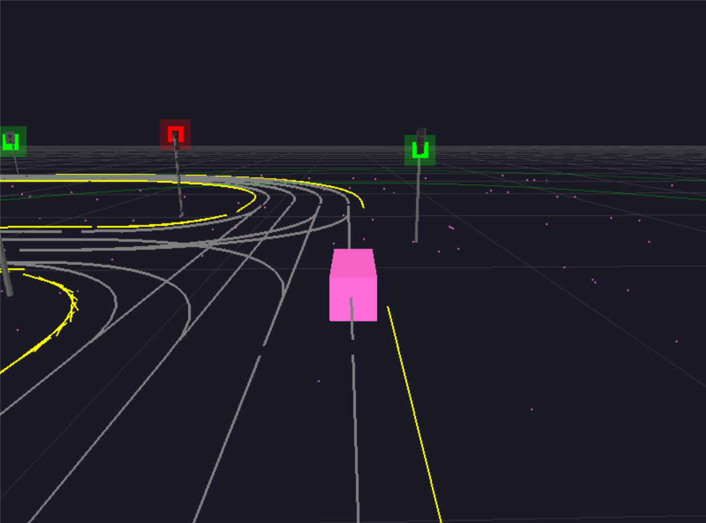

# CarlaViz

CARLA 3D可视化工具 - 实时可视化CARLA仿真环境

目前适配win11的carla0.9.16版本，适配linux还在开发中



## 功能特性

- **实时3D渲染**：基于Pygame和OpenGL，流畅的可视化效果
- **网页可视化**：可选的Flask网页服务器，支持远程查看
- **自动CARLA检测**：自动连接正在运行的CARLA环境，无需手动指定脚本
- **多种相机模式**：跟随模式（追踪自车）和自由视角模式
- **丰富的场景元素**：道路、建筑、车辆、交通信号灯
- **跨平台支持**：支持Windows、Linux和macOS
- **红绿灯可视化**：根据CARLA交通灯状态显示红/黄/绿

## 安装

### 从源码安装

```bash
git clone https://github.com/z-g-z2007/carla-win.git
cd carlaviz
pip install -e .
```

### 安装Web支持

```bash
pip install -e .[web]
```

### 安装开发依赖

```bash
pip install -e .[dev]
```

## 使用方法

### 基础使用（Pygame窗口）

```bash
carlaviz
```

### 启用网页服务器

```bash
carlaviz --web
```

### 指定CARLA服务器

```bash
carlaviz --host 0.0.0.0 --port 2000
```

### 同时启用网页和自定义端口

```bash
carlaviz --host 0.0.0.0 --port 2000 --web 8080
```

### 无头模式（仅网页，不显示Pygame窗口）

```bash
carlaviz --web --headless
```

### Python API使用

```python
from carlaviz import CarlaViz, CarlaVizWebServer

# 基础Pygame窗口
viz = CarlaViz(host='0.0.0.0', port=2000)
viz.run()

# 带网页服务器
web_server = CarlaVizWebServer(port=8080)
web_server.start()

viz = CarlaViz(host='0.0.0.0', port=2000, headless=True)
viz.run()

web_server.stop()
```

## 命令行参数

| 参数 | 说明 | 默认值       |
|------|------|-----------|
| `--host` | CARLA服务器地址 | `0.0.0.0` |
| `--port` | CARLA服务器端口 | `2000`    |
| `--web [PORT]` | 启用网页服务器（可选端口） | `8080`    |
| `--headless` | 无头模式（不显示窗口） | `False`   |

## 键盘控制

| 按键 | 功能 |
|------|------|
| `ESC` | 退出程序 |
| `TAB` | 切换跟随/自由视角模式 |
| `鼠标左键+拖动` | 旋转相机 |
| `鼠标右键+拖动` | 平移相机 |
| `鼠标滚轮` | 缩放 |

## 自车检测

CarlaViz自动检测自车，优先级如下：

1. `role_name` 属性设置为 `ego`、`hero`、`autopilot`、`player` 或 `agent` 的车辆
2. 启用了自动驾驶的车辆
3. 场景中的第一辆车

## 项目结构

```
carlaviz/
├── carlaviz/
│   ├── __init__.py          # 包初始化
│   ├── cli.py               # 命令行接口
│   ├── core/
│   │   ├── __init__.py
│   │   ├── camera.py        # 相机控制
│   │   ├── renderer.py      # OpenGL渲染器
│   │   └── visualizer.py    # 主可视化类
│   ├── web/
│   │   ├── __init__.py
│   │   └── server.py        # Flask网页服务器
│   └── utils/
│       ├── __init__.py
│       └── carla_utils.py    # CARLA工具函数
├── examples/
│   ├── basic_usage.py       # 基础使用示例
│   └── with_web_server.py   # 网页服务器示例
├── tests/                   # 测试目录
├── requirements.txt         # 依赖列表
├── setup.py                # 安装配置
└── pyproject.toml         # 项目元数据
```

## 依赖

### 核心依赖

- Python = 3.12
- pygame >= 2.0
- numpy >= 1.21
- Pillow >= 8.0
- PyOpenGL >= 3.1

### 可选依赖

- flask >= 2.0 (网页服务器支持)
- carla (CARLA仿真器连接)

## 开发

### 克隆项目

```bash
git clone https://github.com/z-g-z2007/carla-win.git
cd carlaviz
```

### 创建虚拟环境

```bash
python -m venv venv

venv\Scripts\activate  # Windows
```

### 安装开发依赖

```bash
pip install -e .[dev]
```

### 运行测试

```bash
pytest tests/
```

## 许可证

本项目采用 MIT 许可证 - 详见 [LICENSE](LICENSE) 文件

## 贡献

欢迎提交Issue和Pull Request！

## 联系方式

- GitHub Issues: https://github.com/z-g-z2007/carla-win/issues
